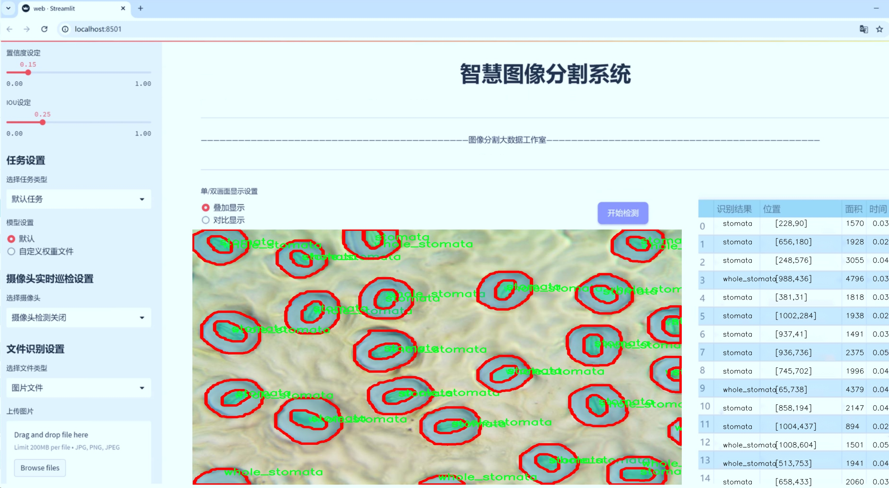
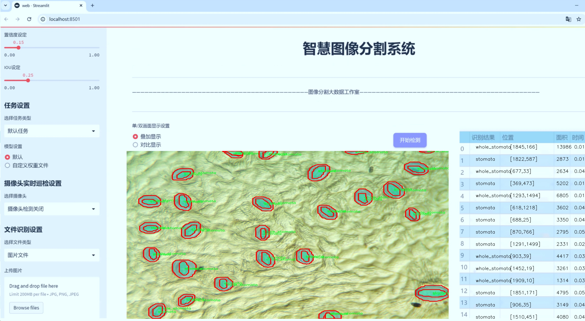
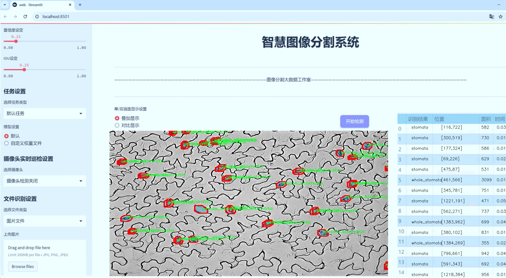
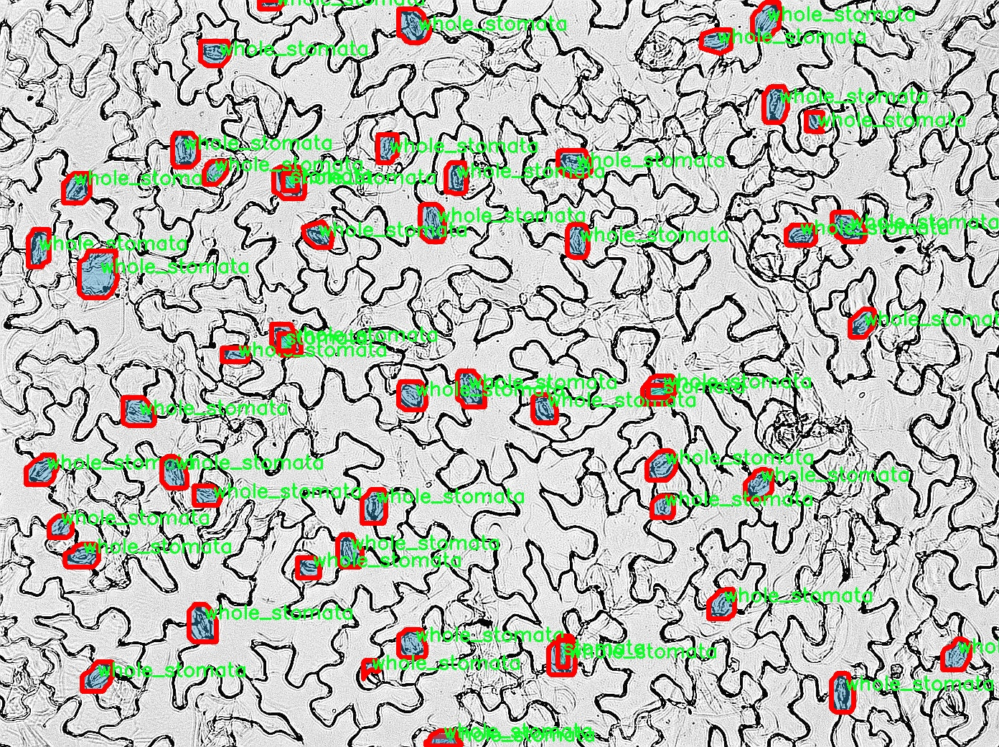
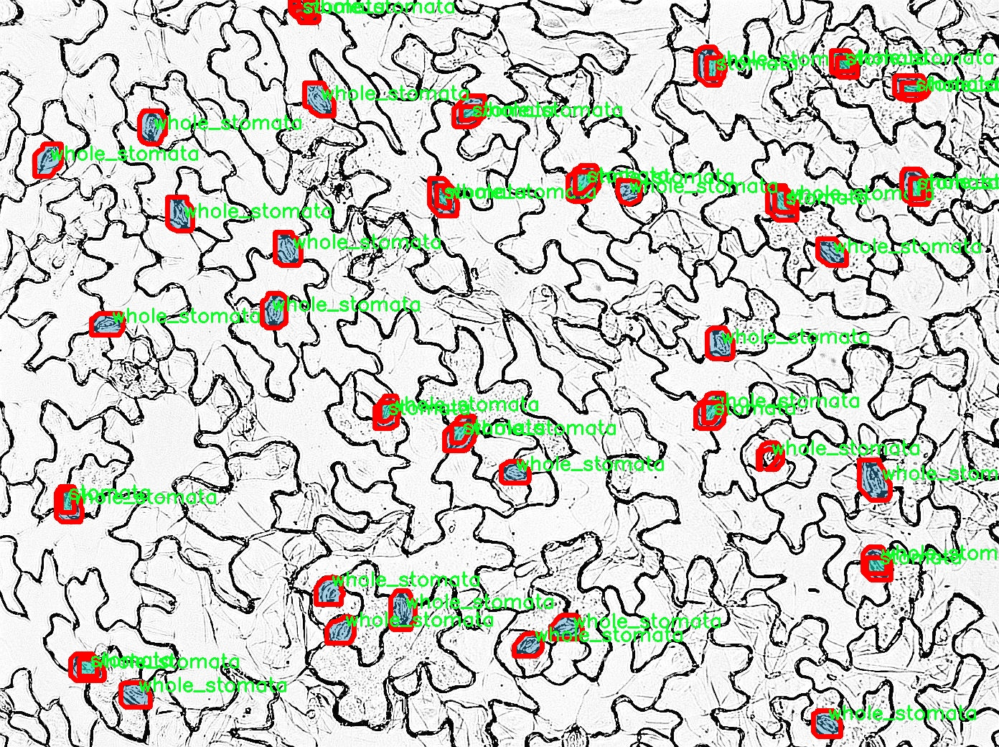
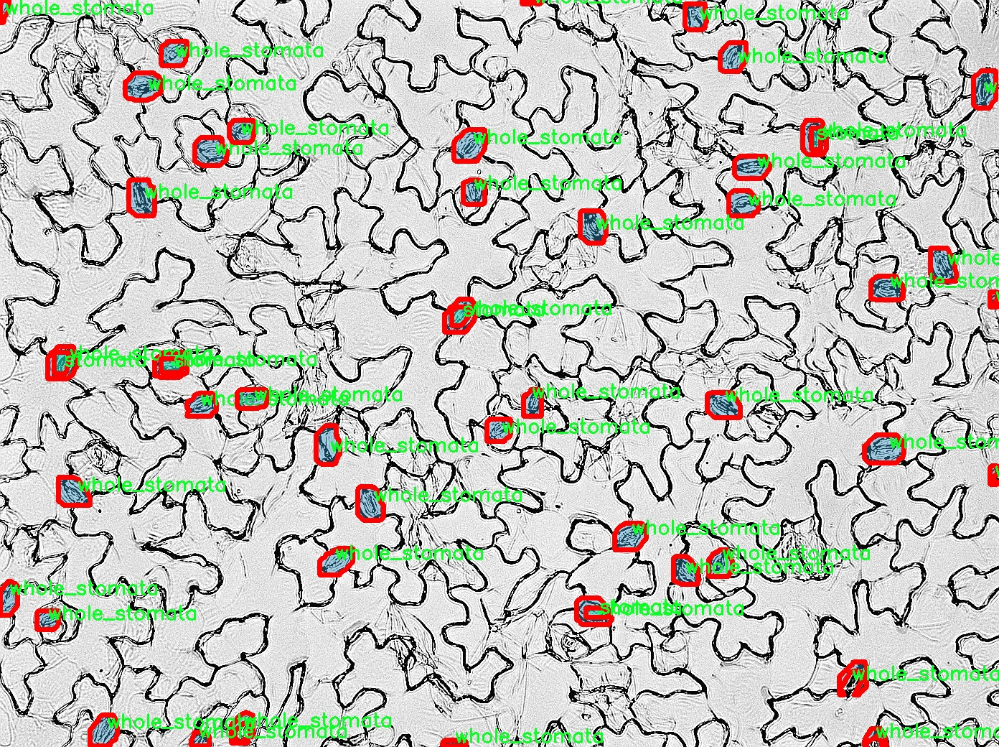
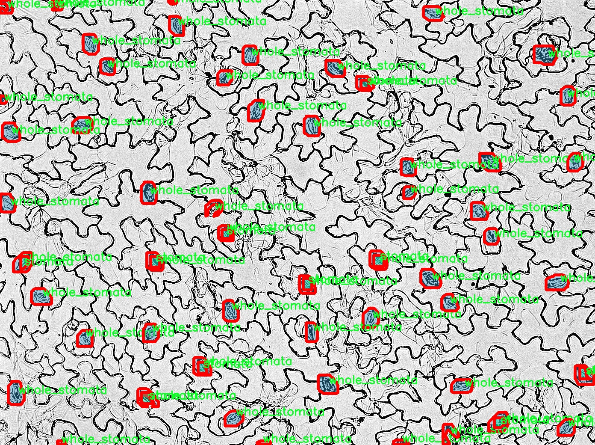
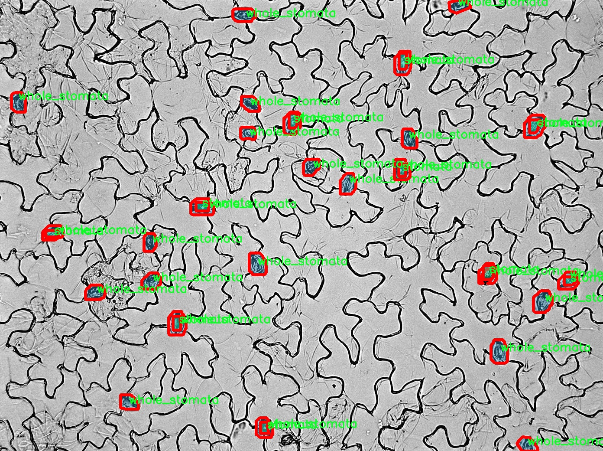

# 显微镜下叶片气孔图像分割系统源码＆数据集分享
 [yolov8-seg-C2f-DWR＆yolov8-seg-C2f-RFAConv等50+全套改进创新点发刊_一键训练教程_Web前端展示]

### 1.研究背景与意义

项目参考[ILSVRC ImageNet Large Scale Visual Recognition Challenge](https://gitee.com/YOLOv8_YOLOv11_Segmentation_Studio/projects)

项目来源[AAAI Global Al lnnovation Contest](https://kdocs.cn/l/cszuIiCKVNis)

研究背景与意义

随着植物生理学和生态学研究的深入，叶片气孔在植物气体交换、光合作用及水分调节等方面的重要性愈发凸显。气孔的形态特征与其功能密切相关，因此对气孔的准确识别与分析对于理解植物的生理状态及其对环境变化的响应具有重要意义。传统的气孔观察方法多依赖于人工计数和测量，不仅耗时耗力，而且容易受到人为因素的影响，导致数据的准确性和可靠性不足。随着计算机视觉技术的迅速发展，基于深度学习的图像分割方法为气孔的自动识别与分析提供了新的解决方案。

YOLO（You Only Look Once）系列模型以其高效的实时目标检测能力在计算机视觉领域取得了显著的成果。YOLOv8作为该系列的最新版本，结合了更为先进的网络结构和优化算法，展现出更强的特征提取能力和更高的检测精度。然而，针对显微镜下叶片气孔图像的分割任务，YOLOv8的标准模型仍存在一定的局限性，特别是在处理小目标和复杂背景时，分割效果不尽如人意。因此，基于YOLOv8的改进，开发一个专门针对显微镜下叶片气孔图像的分割系统，具有重要的学术价值和应用前景。

本研究将构建一个基于改进YOLOv8的显微镜下叶片气孔图像分割系统，利用现有的“leaf_stomata”数据集，该数据集包含1100幅图像，涵盖了气孔及其整体结构的两类标注。这一数据集为模型的训练和验证提供了丰富的样本，能够有效支持模型的学习和优化。通过对YOLOv8的改进，增强其对小目标的检测能力，提升模型在复杂背景下的分割精度，从而实现对气孔的高效、准确识别。

本研究的意义不仅在于推动植物生理学研究的技术进步，还在于为相关领域提供一种新的分析工具。通过自动化的气孔图像分割系统，研究人员可以更加高效地获取气孔特征数据，进而进行大规模的生理生态研究。这将有助于深入理解植物的生长机制、环境适应性及其在气候变化背景下的响应策略。此外，该系统的开发还将为农业科学、环境监测等领域提供重要的技术支持，促进相关研究的开展。

综上所述，基于改进YOLOv8的显微镜下叶片气孔图像分割系统的研究，不仅填补了当前气孔图像分析技术的空白，还为植物科学的研究提供了新的视角和方法。通过这一系统的实现，将推动植物生理学、生态学及相关领域的研究进展，为可持续农业和生态保护提供科学依据和技术支持。

### 2.图片演示







##### 注意：由于此博客编辑较早，上面“2.图片演示”和“3.视频演示”展示的系统图片或者视频可能为老版本，新版本在老版本的基础上升级如下：（实际效果以升级的新版本为准）

  （1）适配了YOLOV8的“目标检测”模型和“实例分割”模型，通过加载相应的权重（.pt）文件即可自适应加载模型。

  （2）支持“图片识别”、“视频识别”、“摄像头实时识别”三种识别模式。

  （3）支持“图片识别”、“视频识别”、“摄像头实时识别”三种识别结果保存导出，解决手动导出（容易卡顿出现爆内存）存在的问题，识别完自动保存结果并导出到tempDir中。

  （4）支持Web前端系统中的标题、背景图等自定义修改，后面提供修改教程。

  另外本项目提供训练的数据集和训练教程,暂不提供权重文件（best.pt）,需要您按照教程进行训练后实现图片演示和Web前端界面演示的效果。

### 3.视频演示

[3.1 视频演示](https://www.bilibili.com/video/BV19EyoYAEhN/)

### 4.数据集信息展示

##### 4.1 本项目数据集详细数据（类别数＆类别名）

nc: 2
names: ['stomata', 'whole_stomata']


##### 4.2 本项目数据集信息介绍

数据集信息展示

在本研究中，我们使用了名为“leaf_stomata”的数据集，以支持对显微镜下叶片气孔图像的分割系统的训练与改进。该数据集专注于植物叶片中气孔的检测与分析，具有重要的生态学和农业科学意义。气孔是植物进行气体交换的关键结构，其数量和分布对植物的生长、光合作用及水分蒸发等生理过程有着直接影响。因此，准确识别和分割气孔图像，对于深入理解植物生理特性以及改进作物管理策略具有重要的应用价值。

“leaf_stomata”数据集包含了丰富的图像数据，涵盖了不同种类和生长阶段的植物叶片气孔。这些图像是在显微镜下拍摄的，能够清晰地展示气孔的形态特征和空间分布。数据集中设定了两个主要类别：第一类是“stomata”，代表单个气孔的图像；第二类是“whole_stomata”，则表示包含多个气孔的整体图像。这种分类方式使得模型在训练过程中能够更好地学习到气孔的细微特征和整体结构，从而提高分割的准确性和鲁棒性。

在数据集的构建过程中，研究团队对每一张图像进行了精细的标注，确保每个气孔的边界都得到了准确的描绘。这一过程不仅要求标注人员具备专业的植物学知识，还需要对显微镜图像的处理有深刻的理解。通过这种高质量的标注，数据集为后续的深度学习模型提供了坚实的基础，使得模型能够在训练阶段有效地学习到气孔的特征。

此外，数据集的多样性也为模型的泛化能力提供了保障。不同植物种类的叶片气孔在形态和分布上可能存在显著差异，因此“leaf_stomata”数据集的多样性能够帮助模型适应各种不同的气孔特征。这一特性对于实际应用至关重要，因为在真实环境中，植物的种类和生长条件千差万别，模型需要具备一定的适应性，以便在不同的应用场景中都能表现出良好的性能。

为了确保模型的训练效果，研究团队还对数据集进行了合理的划分，包括训练集、验证集和测试集。这种划分方式使得模型在训练过程中能够不断进行自我调整和优化，从而在测试阶段展现出更高的准确率和可靠性。通过对“leaf_stomata”数据集的深入分析与利用，我们期望能够显著提升YOLOv8-seg在显微镜下叶片气孔图像分割任务中的表现，为植物生理研究和农业应用提供更为精确的工具。

综上所述，“leaf_stomata”数据集不仅在数量和质量上都具备良好的基础，更在研究的实际应用中展现出广泛的前景。通过对该数据集的有效利用，我们相信能够推动显微镜下叶片气孔图像分割技术的发展，为相关领域的研究提供新的思路和方法。











### 5.全套项目环境部署视频教程（零基础手把手教学）

[5.1 环境部署教程链接（零基础手把手教学）](https://www.bilibili.com/video/BV1jG4Ve4E9t/?vd_source=bc9aec86d164b67a7004b996143742dc)


[5.2 安装Python虚拟环境创建和依赖库安装视频教程链接（零基础手把手教学）](https://www.bilibili.com/video/BV1nA4VeYEze/?vd_source=bc9aec86d164b67a7004b996143742dc)

### 6.手把手YOLOV8-seg训练视频教程（零基础小白有手就能学会）

[6.1 手把手YOLOV8-seg训练视频教程（零基础小白有手就能学会）](https://www.bilibili.com/video/BV1cA4VeYETe/?vd_source=bc9aec86d164b67a7004b996143742dc)


按照上面的训练视频教程链接加载项目提供的数据集，运行train.py即可开始训练



     Epoch   gpu_mem       box       obj       cls    labels  img_size
     1/200     0G   0.01576   0.01955  0.007536        22      1280: 100%|██████████| 849/849 [14:42<00:00,  1.04s/it]
               Class     Images     Labels          P          R     mAP@.5 mAP@.5:.95: 100%|██████████| 213/213 [01:14<00:00,  2.87it/s]
                 all       3395      17314      0.994      0.957      0.0957      0.0843

     Epoch   gpu_mem       box       obj       cls    labels  img_size
     2/200     0G   0.01578   0.01923  0.007006        22      1280: 100%|██████████| 849/849 [14:44<00:00,  1.04s/it]
               Class     Images     Labels          P          R     mAP@.5 mAP@.5:.95: 100%|██████████| 213/213 [01:12<00:00,  2.95it/s]
                 all       3395      17314      0.996      0.956      0.0957      0.0845

     Epoch   gpu_mem       box       obj       cls    labels  img_size
     3/200     0G   0.01561    0.0191  0.006895        27      1280: 100%|██████████| 849/849 [10:56<00:00,  1.29it/s]
               Class     Images     Labels          P          R     mAP@.5 mAP@.5:.95: 100%|███████   | 187/213 [00:52<00:00,  4.04it/s]
                 all       3395      17314      0.996      0.957      0.0957      0.0845


### 7.50+种全套YOLOV8-seg创新点代码加载调参视频教程（一键加载写好的改进模型的配置文件）

[7.1 50+种全套YOLOV8-seg创新点代码加载调参视频教程（一键加载写好的改进模型的配置文件）](https://www.bilibili.com/video/BV1Hw4VePEXv/?vd_source=bc9aec86d164b67a7004b996143742dc)

### 8.YOLOV8-seg图像分割算法原理

原始YOLOv8-seg算法原理

YOLOv8-seg算法作为目标检测和实例分割领域的前沿技术，承载着YOLO系列模型的创新与发展。自2023年1月10日推出以来，YOLOv8-seg凭借其卓越的性能和高效的计算能力，迅速成为计算机视觉任务中的重要工具。该算法在YOLOv5的基础上进行了多项重要改进，旨在提高目标检测的精度和速度，同时扩展到更复杂的分割任务。

首先，YOLOv8-seg在骨干网络设计上采用了跨级结构（Cross Stage Partial, CSP）的思想，这一设计理念旨在通过分割和融合特征来增强模型的表达能力。与YOLOv5中的C3模块相比，YOLOv8-seg引入了更轻量的C2f模块，这种模块通过引入更多的跳层连接和Split操作，优化了特征的流动性和信息的传递效率。此外，YOLOv8-seg保留了空间金字塔池化（SPPF）模块，以增强模型对多尺度目标的检测能力。

在特征融合方面，YOLOv8-seg继续采用特征金字塔网络（PAN-FPN）结构，通过多尺度特征融合技术，将来自不同层次的特征图进行有效结合。这种方法不仅提升了模型对不同尺度目标的检测性能，还增强了其对复杂场景的适应能力。尤其是在处理小目标和高分辨率图像时，YOLOv8-seg展现出了优异的性能，能够在保持高精度的同时，显著降低计算资源的消耗。

YOLOv8-seg的另一个显著创新在于其新的损失函数设计。该算法采用了变焦损失（Focal Loss）来计算分类损失，并结合数据平均保真度损失和完美交并比损失（Perfect IoU Loss）来优化边界框的回归过程。这种新的损失策略使得YOLOv8-seg在处理难以分类的样本时，能够更好地聚焦于重要的目标，从而提高了检测的准确性和鲁棒性。

在检测头的设计上，YOLOv8-seg实现了从传统的Anchor-Based方法向Anchor-Free方法的转变。这一变化不仅简化了模型的结构，还消除了之前的objectness分支，转而采用解耦的分类和回归分支。这种设计使得模型在处理复杂场景时，能够更加灵活地适应不同目标的形状和大小，从而提高了目标检测的精度。

YOLOv8-seg的网络结构分为三个主要部分：Backbone、Neck和Head。Backbone部分通过一系列卷积和反卷积层提取特征，同时使用残差连接和瓶颈结构来减小网络的复杂度并提升性能。Neck部分则负责多尺度特征的融合，确保不同层次的特征能够有效结合，以捕捉到更多的上下文信息。最后，Head部分则专注于最终的目标检测和分类任务，通过多个检测头来处理不同尺寸的信息，确保模型在各种场景下的高效性和准确性。

值得一提的是，YOLOv8-seg在模型的训练和部署方面也进行了优化，采用了新的PyTorch训练框架，使得自定义模型的训练变得更加方便。这一改进不仅提升了模型的可用性，也为研究人员和开发者提供了更大的灵活性，能够根据具体的应用需求进行调整和优化。

总的来说，YOLOv8-seg算法通过一系列创新的设计和优化，极大地提升了目标检测和实例分割的性能。其在骨干网络、特征融合、损失函数以及检测头等多个方面的改进，使得YOLOv8-seg在计算机视觉领域中占据了重要的位置。随着技术的不断进步，YOLOv8-seg无疑将为更多实际应用提供强有力的支持，推动目标检测和实例分割技术的进一步发展。


### 9.系统功能展示（检测对象为举例，实际内容以本项目数据集为准）

图9.1.系统支持检测结果表格显示

  图9.2.系统支持置信度和IOU阈值手动调节

  图9.3.系统支持自定义加载权重文件best.pt(需要你通过步骤5中训练获得)

  图9.4.系统支持摄像头实时识别

  图9.5.系统支持图片识别

  图9.6.系统支持视频识别

  图9.7.系统支持识别结果文件自动保存

  图9.8.系统支持Excel导出检测结果数据


### 10.50+种全套YOLOV8-seg创新点原理讲解（非科班也可以轻松写刊发刊，V11版本正在科研待更新）

#### 10.1 由于篇幅限制，每个创新点的具体原理讲解就不一一展开，具体见下列网址中的创新点对应子项目的技术原理博客网址【Blog】：


[10.1 50+种全套YOLOV8-seg创新点原理讲解链接](https://gitee.com/qunmasj/good)

#### 10.2 部分改进模块原理讲解(完整的改进原理见上图和技术博客链接)【如果此小节的图加载失败可以通过CSDN或者Github搜索该博客的标题访问原始博客，原始博客图片显示正常】
### YOLOv8模型原理

YOLOv8是YOLO系列最新的模型,具有非常优秀的检测精度和速度。根据网络的深度与特征图的宽度大小, YOLOv8算法分为:YOLOv8-n、YOLOv8一s 、YOLOv8-m 、 YOLOv8-l、和 YOLOv8-x 5个版本。按照网络结构图,YOLOv8可分为: Inpul 、 Backbone , Neck和Head 4部分。


Backbone采用了CSPDarknet 架构，由CBS (标准卷积层)、C2f模块和 SPPF(金字塔池化）组成。通过5次标准卷积层和C2f模块逐步提取图像特征，并在网络末尾添加SPPF模块，将任意大小的输入图像转换成固定大小的特征向量。分别取P3、P4、P5层的特征提取结果，向Head输出80×80、40 × 40、20×20三个尺度的特征层。
C2f模块借鉴了残差网络(ResNet)以及ELAN的思想，其结构分为两个分支，主干部分利用Bottleneckm2%模块逐步加深网络，分支部分保留输入层通道并与主干部分特征进行融合，如图所示。通过标准卷积层提取新的特征层，相比于YOLOv5使用的C3模块，C2f模块可以在卷积层和全连接层之间建立一个平滑的转换，从而实现了参数的共享，提高了模型的效率和泛化能力。
Head采用了PAN-FPN 结构,将 Backbone输入的3个特征层进行多尺度融合，进行自顶向下(FAN)和自底向上 (PAN)的特征传递，对金字塔进行增强，使不同尺寸的特征图都包含强目标语义信息和强目标特征信息，保证了对不同尺寸样本的准确预测。
Detect借鉴了Decoupled-Head 思想，用一个解耦检测头将输入的不同尺寸特征层分成2个分支进行检测。第1个分支在进行3次卷积后使进行回归任务，输出预测框。第2个分支在进行3次卷积后进行分类任务，输出类别的概率。采用Varifocal_Loss2”作为损失函数，其式为:


### Context_Grided_Network(CGNet)简介
参考该博客提出的一种轻量化语义分割模型Context Grided Network(CGNet)，以满足设备的运行需要。

CGNet主要由CG块构建而成，CG块可以学习局部特征和周围环境上下文的联合特征，最后通过引入全局上下文特征进一步改善联合特征的学习。


 
下图给出了在Cityscapes数据集上对现有的一些语义分割模型的测试效果，横轴表示参数量，纵轴表示准确率(mIoU)。可以看出，在参数量较少的情况下，CGNet可以达到一个比较好的准确率。虽与高精度模型相去甚远，但在一些对精度要求不高、对实时性要求比较苛刻的情况下，很有价值。


高精度模型，如DeepLab、DFN、DenseASPP等，动不动就是几十M的参数，很难应用在移动设备上。而上图中红色的模型，相对内存占用较小，但它们的分割精度却不是很高。作者认为主要原因是，这些小网络大多遵循着分类网络的设计思路，并没有考虑语义分割任务更深层次的特点。

空间依赖性和上下文信息对提高分割精度有很大的作用。作者从该角度出发，提出了CG block，并进一步搭建了轻量级语义分割网络CGNet。CG块具有以下特点： 

学习局部特征和上下文特征的联合特征；
通过全局上下文特征改进上述联合特征；
可以贯穿应用在整个网络中，从low level（空间级别）到high level（语义级别）。不像PSPNet、DFN、DenseASPP等，只在编码阶段以后捕捉上下文特征。；
只有3个下采样，相比一般5个下采样的网络，能够更好地保留边缘信息。
CGNet遵循“深而薄”的原则设计，整个网络又51层构成。其中，为了降低计算，大量使用了channel-wise conv.

小型语义分割模型：

需要平衡准确率和系统开销
进化路线：ENet -> ICNet -> ESPNet
这些模型基本都基于分类网络设计，在分割准确率上效果并不是很好
上下文信息模型：

大多数现有模型只考虑解码阶段的上下文信息并且没有利用周围的上下文信息
注意力机制：

CG block使用全局上下文信息计算权重向量，并使用其细化局部特征和周围上下文特征的联合特征

#### Context Guided Block
CG block由4部分组成：


此外，CG block还采用了残差学习。文中提出了局部残差学习（LRL）和全局残差学习（GRL）两种方式。 LRL添加了从输入到联合特征提取器的连接，GRL添加了从输入到全局特征提取器的连接。从直观上来说，GRL比LRL更能促进网络中的信息传递（更像ResNet~~），后面实验部分也进行了测试，的确GRL更能提升分割精度。


CGNet的通用网络结构如下图所示，分为3个stage，第一个stage使用3个卷积层抽取特征，第二和第三个stage堆叠一定数量的CG block，具体个数可以根据情况调整。最后，通过1x1 conv得到分割结果。


下图是用于Cityscapes数据集的CGNet网络细节说明：输入尺寸为3*680*680；stage1连续使用了3个Conv-BN-PReLU组合，首个组合使用了stride=2的卷积，所以得到了1/2分辨率的feature map；stage2和stage3分别使用了多个CG block，且其中使用了不同大小的膨胀卷积核，最终分别得到了1/4和1/8的feature map。

需注意：

stage2&3的输入特征分别由其上一个stage的首个和最后一个block组合给出（参考上图的绿色箭头）；

输入注入机制，图中未体现，实际使用中，作者还将输入图像下采样1/4或1/8，分别给到stage2和stage3的输入中 ，以进一步加强特征传递。

channel-wise conv。为了缩减参数数量，在局部特征提取器和周围上下文特征提取器中使用了channel-wise卷积，可以消除跨通道的计算成本，同时节省内存占用。但是，没有像MobileNet等模型一样，在depth-wise卷积后面接point-wise卷积（1*1 conv），作者解释是，因为CG block需要保持局部特征和周围上下文特征的独立性，而1*1 conv会破坏这种独立性，所以效果欠佳，实验部分也进行了验证。

个人感觉此处应该指的是depth-wise卷积？

官方Git中对该部分的实现如下：


### 11.项目核心源码讲解（再也不用担心看不懂代码逻辑）

#### 11.1 ultralytics\utils\callbacks\__init__.py

下面是对给定代码的逐行分析和详细中文注释，保留了最核心的部分：

```python
# Ultralytics YOLO 🚀, AGPL-3.0 license

# 从当前包的 base 模块中导入三个函数：add_integration_callbacks、default_callbacks 和 get_default_callbacks
from .base import add_integration_callbacks, default_callbacks, get_default_callbacks

# 定义模块的公开接口，只有这三个函数可以被外部访问
__all__ = 'add_integration_callbacks', 'default_callbacks', 'get_default_callbacks'
```

### 代码分析与注释：

1. **模块说明**：
   - `# Ultralytics YOLO 🚀, AGPL-3.0 license`：这行注释表明该代码属于 Ultralytics YOLO 项目，并且遵循 AGPL-3.0 许可证。

2. **导入语句**：
   - `from .base import add_integration_callbacks, default_callbacks, get_default_callbacks`：
     - 这行代码从当前包的 `base` 模块中导入了三个函数。这意味着这些函数在 `base` 模块中定义，且可能用于集成回调或获取默认回调。

3. **公开接口定义**：
   - `__all__ = 'add_integration_callbacks', 'default_callbacks', 'get_default_callbacks'`：
     - 这行代码定义了模块的公开接口。通过定义 `__all__`，可以控制哪些名称可以被 `from module import *` 语句导入。只有列在 `__all__` 中的名称才会被导入，这有助于隐藏模块内部的实现细节。

### 核心部分总结：
- 该代码的核心在于导入了三个重要的回调函数，并通过 `__all__` 机制控制了模块的公开接口。这为模块的使用者提供了清晰的 API，同时隐藏了不必要的内部实现。

这个文件是Ultralytics YOLO项目中的一个初始化文件，位于`ultralytics/utils/callbacks`目录下。它的主要功能是导入和暴露一些与回调函数相关的工具和功能，以便在其他模块中使用。

首先，文件开头的注释部分表明该项目是Ultralytics YOLO，遵循AGPL-3.0许可证。这意味着该代码是开源的，用户可以自由使用和修改，但需要遵循相应的许可证条款。

接下来，文件通过相对导入的方式引入了三个函数：`add_integration_callbacks`、`default_callbacks`和`get_default_callbacks`。这些函数的具体实现位于同一目录下的`base`模块中。虽然文件中没有提供这些函数的具体实现，但从函数名可以推测，它们与回调机制有关，可能用于集成回调、获取默认回调以及管理回调的相关功能。

最后，`__all__`变量定义了该模块公开的接口，即在使用`from module import *`语句时，将会导入的名称。这里定义的名称包括`add_integration_callbacks`、`default_callbacks`和`get_default_callbacks`，这意味着其他模块在导入这个包时，可以直接使用这三个函数，而不需要知道它们的具体实现细节。

总的来说，这个文件的作用是为回调相关的功能提供一个简洁的接口，使得其他部分的代码能够方便地使用这些功能。

#### 11.2 ui.py

以下是经过简化并添加详细中文注释的核心代码部分：

```python
import sys
import subprocess

def run_script(script_path):
    """
    使用当前 Python 环境运行指定的脚本。

    参数:
        script_path (str): 要运行的脚本路径

    返回:
        None
    """
    # 获取当前 Python 解释器的路径
    python_path = sys.executable

    # 构建运行命令，使用 streamlit 运行指定的脚本
    command = f'"{python_path}" -m streamlit run "{script_path}"'

    # 执行命令并等待其完成
    result = subprocess.run(command, shell=True)
    
    # 检查命令执行结果，如果返回码不为0，则表示出错
    if result.returncode != 0:
        print("脚本运行出错。")

# 如果该脚本是主程序，则执行以下代码
if __name__ == "__main__":
    # 指定要运行的脚本路径
    script_path = "web.py"  # 这里可以直接指定脚本名

    # 调用函数运行指定的脚本
    run_script(script_path)
```

### 代码注释说明：
1. **导入模块**：导入 `sys` 和 `subprocess` 模块，前者用于获取 Python 解释器路径，后者用于执行系统命令。
2. **`run_script` 函数**：定义一个函数，用于运行指定路径的 Python 脚本。
   - **获取 Python 解释器路径**：使用 `sys.executable` 获取当前 Python 解释器的完整路径。
   - **构建命令**：使用 f-string 构建一个命令字符串，调用 `streamlit` 来运行指定的脚本。
   - **执行命令**：使用 `subprocess.run` 执行构建的命令，并等待其完成。
   - **检查返回码**：如果返回码不为0，打印错误信息，表示脚本运行出错。
3. **主程序入口**：通过 `if __name__ == "__main__":` 确保只有在直接运行该脚本时才会执行以下代码。
   - **指定脚本路径**：可以直接指定要运行的脚本名称。
   - **调用 `run_script` 函数**：执行运行脚本的操作。

这个程序文件的主要功能是使用当前的 Python 环境来运行一个指定的脚本，具体来说是运行一个名为 `web.py` 的脚本。程序首先导入了必要的模块，包括 `sys`、`os` 和 `subprocess`，这些模块分别用于获取系统信息、处理文件路径和执行外部命令。

在 `run_script` 函数中，首先获取当前 Python 解释器的路径，这样可以确保使用的是当前环境的 Python。接着，构建一个命令字符串，这个命令会调用 `streamlit` 模块来运行指定的脚本。`streamlit` 是一个用于构建数据应用的库，通常用于快速开发和展示数据可视化应用。

然后，使用 `subprocess.run` 方法来执行这个命令。这个方法会在一个新的 shell 中运行命令，并等待其完成。如果脚本运行过程中出现错误，返回的 `returncode` 将不为零，程序会打印出“脚本运行出错”的提示信息。

在文件的最后部分，使用 `if __name__ == "__main__":` 语句来确保只有在直接运行该文件时才会执行下面的代码。这里指定了要运行的脚本路径为 `web.py`，并调用 `run_script` 函数来执行这个脚本。

总的来说，这个程序是一个简单的脚本启动器，能够方便地在当前 Python 环境中运行指定的 Streamlit 应用。

#### 11.3 ultralytics\models\yolo\detect\train.py

以下是经过简化并添加详细中文注释的核心代码部分：

```python
# 导入必要的库
from copy import copy
import numpy as np
from ultralytics.data import build_dataloader, build_yolo_dataset
from ultralytics.engine.trainer import BaseTrainer
from ultralytics.models import yolo
from ultralytics.nn.tasks import DetectionModel
from ultralytics.utils import LOGGER, RANK
from ultralytics.utils.torch_utils import de_parallel, torch_distributed_zero_first

class DetectionTrainer(BaseTrainer):
    """
    DetectionTrainer类，继承自BaseTrainer，用于基于检测模型的训练。
    """

    def build_dataset(self, img_path, mode='train', batch=None):
        """
        构建YOLO数据集。

        参数:
            img_path (str): 包含图像的文件夹路径。
            mode (str): 模式，'train'表示训练模式，'val'表示验证模式。
            batch (int, optional): 批次大小，适用于'rect'模式。默认为None。
        """
        # 获取模型的最大步幅，确保步幅至少为32
        gs = max(int(de_parallel(self.model).stride.max() if self.model else 0), 32)
        # 构建YOLO数据集
        return build_yolo_dataset(self.args, img_path, batch, self.data, mode=mode, rect=mode == 'val', stride=gs)

    def get_dataloader(self, dataset_path, batch_size=16, rank=0, mode='train'):
        """构造并返回数据加载器。"""
        assert mode in ['train', 'val']  # 确保模式有效
        with torch_distributed_zero_first(rank):  # 在分布式训练中，仅初始化一次数据集
            dataset = self.build_dataset(dataset_path, mode, batch_size)  # 构建数据集
        shuffle = mode == 'train'  # 训练模式下打乱数据
        # 如果数据集为矩形且处于训练模式，发出警告并禁用打乱
        if getattr(dataset, 'rect', False) and shuffle:
            LOGGER.warning("WARNING ⚠️ 'rect=True'与DataLoader的shuffle不兼容，设置shuffle=False")
            shuffle = False
        workers = self.args.workers if mode == 'train' else self.args.workers * 2  # 设置工作线程数
        return build_dataloader(dataset, batch_size, workers, shuffle, rank)  # 返回数据加载器

    def preprocess_batch(self, batch):
        """对图像批次进行预处理，包括缩放和转换为浮点数。"""
        batch['img'] = batch['img'].to(self.device, non_blocking=True).float() / 255  # 将图像转换为浮点数并归一化
        return batch

    def set_model_attributes(self):
        """设置模型的属性，包括类别数量和名称。"""
        self.model.nc = self.data['nc']  # 将类别数量附加到模型
        self.model.names = self.data['names']  # 将类别名称附加到模型
        self.model.args = self.args  # 将超参数附加到模型

    def get_model(self, cfg=None, weights=None, verbose=True):
        """返回YOLO检测模型。"""
        model = DetectionModel(cfg, nc=self.data['nc'], verbose=verbose and RANK == -1)  # 创建检测模型
        if weights:
            model.load(weights)  # 加载权重
        return model

    def plot_training_samples(self, batch, ni):
        """绘制训练样本及其注释。"""
        plot_images(images=batch['img'],
                    batch_idx=batch['batch_idx'],
                    cls=batch['cls'].squeeze(-1),
                    bboxes=batch['bboxes'],
                    paths=batch['im_file'],
                    fname=self.save_dir / f'train_batch{ni}.jpg',
                    on_plot=self.on_plot)

    def plot_metrics(self):
        """从CSV文件中绘制指标。"""
        plot_results(file=self.csv, on_plot=self.on_plot)  # 保存结果图像
```

### 代码说明：
1. **类定义**：`DetectionTrainer`类用于训练YOLO检测模型，继承自`BaseTrainer`。
2. **数据集构建**：`build_dataset`方法根据给定的图像路径和模式构建YOLO数据集。
3. **数据加载器**：`get_dataloader`方法构造数据加载器，支持分布式训练和数据打乱。
4. **批处理预处理**：`preprocess_batch`方法将图像批次转换为浮点数并进行归一化处理。
5. **模型属性设置**：`set_model_attributes`方法将类别数量和名称附加到模型。
6. **模型获取**：`get_model`方法返回一个YOLO检测模型，并可选择加载预训练权重。
7. **绘图功能**：`plot_training_samples`和`plot_metrics`方法用于可视化训练样本和训练指标。

这个程序文件是Ultralytics YOLO模型的训练模块，主要用于目标检测任务。文件中定义了一个名为`DetectionTrainer`的类，它继承自`BaseTrainer`类，专门用于基于YOLO模型的训练。

在这个类中，首先定义了一个`build_dataset`方法，用于构建YOLO数据集。该方法接收图像路径、模式（训练或验证）和批次大小作为参数。它会根据模型的最大步幅计算出一个合适的步幅值，并调用`build_yolo_dataset`函数来创建数据集。

接着，`get_dataloader`方法用于构建数据加载器。它会检查模式是否为训练或验证，并在分布式训练的情况下，确保数据集只初始化一次。根据模式设置是否打乱数据，并调用`build_dataloader`函数返回数据加载器。

`preprocess_batch`方法用于对图像批次进行预处理，包括将图像转换为浮点数并归一化到0到1之间。

`set_model_attributes`方法则用于设置模型的属性，包括类别数量、类别名称和超参数等。

`get_model`方法用于返回一个YOLO检测模型，可以选择加载预训练权重。

`get_validator`方法返回一个用于YOLO模型验证的`DetectionValidator`实例，并设置损失名称。

`label_loss_items`方法用于返回一个包含训练损失项的字典，便于后续的监控和记录。

`progress_string`方法返回一个格式化的字符串，显示训练进度，包括当前的epoch、GPU内存使用情况、损失值、实例数量和图像大小。

`plot_training_samples`方法用于绘制训练样本及其标注，便于可视化训练过程中的数据。

最后，`plot_metrics`和`plot_training_labels`方法分别用于绘制训练过程中的指标和标签的可视化图像，以便于分析模型的训练效果。

整体来看，这个文件的主要功能是实现YOLO模型的训练过程，包括数据集的构建、数据加载、模型的设置和训练过程中的可视化等。

#### 11.4 ultralytics\models\fastsam\prompt.py

以下是经过简化和注释的核心代码部分：

```python
import os
import numpy as np
import torch
from PIL import Image
import cv2
from ultralytics.utils import TQDM

class FastSAMPrompt:
    """
    Fast Segment Anything Model 类，用于图像标注和可视化。

    属性:
        device (str): 计算设备（'cuda' 或 'cpu'）。
        results: 目标检测或分割结果。
        source: 源图像或图像路径。
        clip: 用于线性分配的 CLIP 模型。
    """

    def __init__(self, source, results, device='cuda') -> None:
        """初始化 FastSAMPrompt，设置源图像、结果和设备，并导入 CLIP 模型。"""
        self.device = device
        self.results = results
        self.source = source

        # 导入并赋值 CLIP 模型
        try:
            import clip  # 用于线性分配
        except ImportError:
            from ultralytics.utils.checks import check_requirements
            check_requirements('git+https://github.com/openai/CLIP.git')
            import clip
        self.clip = clip

    @staticmethod
    def _segment_image(image, bbox):
        """根据提供的边界框坐标对给定图像进行分割。"""
        image_array = np.array(image)  # 将图像转换为数组
        segmented_image_array = np.zeros_like(image_array)  # 创建与原图像相同大小的全零数组
        x1, y1, x2, y2 = bbox  # 解包边界框坐标
        segmented_image_array[y1:y2, x1:x2] = image_array[y1:y2, x1:x2]  # 仅保留边界框内的区域
        segmented_image = Image.fromarray(segmented_image_array)  # 转换为图像
        black_image = Image.new('RGB', image.size, (255, 255, 255))  # 创建白色背景图像
        transparency_mask = np.zeros((image_array.shape[0], image_array.shape[1]), dtype=np.uint8)  # 创建透明度掩码
        transparency_mask[y1:y2, x1:x2] = 255  # 设置边界框区域为不透明
        transparency_mask_image = Image.fromarray(transparency_mask, mode='L')  # 转换为图像
        black_image.paste(segmented_image, mask=transparency_mask_image)  # 将分割图像粘贴到背景上
        return black_image

    @staticmethod
    def _format_results(result, filter=0):
        """将检测结果格式化为包含 ID、分割、边界框、分数和面积的注释列表。"""
        annotations = []
        n = len(result.masks.data) if result.masks is not None else 0  # 获取掩码数量
        for i in range(n):
            mask = result.masks.data[i] == 1.0  # 获取当前掩码
            if torch.sum(mask) >= filter:  # 根据过滤条件判断是否保留
                annotation = {
                    'id': i,
                    'segmentation': mask.cpu().numpy(),
                    'bbox': result.boxes.data[i],
                    'score': result.boxes.conf[i]}
                annotation['area'] = annotation['segmentation'].sum()  # 计算面积
                annotations.append(annotation)  # 添加到注释列表
        return annotations

    def plot(self, annotations, output):
        """
        在图像上绘制注释、边界框和点，并保存输出。

        参数:
            annotations (list): 要绘制的注释。
            output (str or Path): 保存绘图的输出目录。
        """
        pbar = TQDM(annotations, total=len(annotations))  # 进度条
        for ann in pbar:
            result_name = os.path.basename(ann.path)  # 获取结果名称
            image = ann.orig_img[..., ::-1]  # BGR 转 RGB
            plt.figure(figsize=(image.shape[1] / 100, image.shape[0] / 100))  # 设置图像大小
            plt.imshow(image)  # 显示图像

            if ann.masks is not None:
                masks = ann.masks.data  # 获取掩码数据
                self.fast_show_mask(masks, plt.gca())  # 显示掩码

            # 保存图像
            save_path = os.path.join(output, result_name)
            plt.axis('off')  # 关闭坐标轴
            plt.savefig(save_path, bbox_inches='tight', pad_inches=0, transparent=True)  # 保存图像
            plt.close()  # 关闭图像
            pbar.set_description(f'Saving {result_name} to {save_path}')  # 更新进度条描述

    @staticmethod
    def fast_show_mask(annotation, ax):
        """
        快速在给定的 matplotlib 轴上显示掩码注释。

        参数:
            annotation (array-like): 掩码注释。
            ax (matplotlib.axes.Axes): Matplotlib 轴。
        """
        n, h, w = annotation.shape  # 批量、图像高度、图像宽度
        areas = np.sum(annotation, axis=(1, 2))  # 计算每个掩码的面积
        annotation = annotation[np.argsort(areas)]  # 按面积排序

        # 显示掩码
        show = np.zeros((h, w, 4))  # 创建显示图像
        for i in range(n):
            mask = annotation[i]  # 获取当前掩码
            color = np.random.random(3)  # 随机颜色
            show[..., :3] += mask[..., np.newaxis] * color  # 应用颜色到掩码
        ax.imshow(show)  # 显示掩码

    @torch.no_grad()
    def retrieve(self, model, preprocess, elements, search_text: str, device) -> int:
        """处理图像和文本，计算相似度并返回 softmax 分数。"""
        preprocessed_images = [preprocess(image).to(device) for image in elements]  # 预处理图像
        tokenized_text = self.clip.tokenize([search_text]).to(device)  # 对文本进行标记化
        stacked_images = torch.stack(preprocessed_images)  # 堆叠图像
        image_features = model.encode_image(stacked_images)  # 编码图像特征
        text_features = model.encode_text(tokenized_text)  # 编码文本特征
        image_features /= image_features.norm(dim=-1, keepdim=True)  # 归一化图像特征
        text_features /= text_features.norm(dim=-1, keepdim=True)  # 归一化文本特征
        probs = 100.0 * image_features @ text_features.T  # 计算相似度
        return probs[:, 0].softmax(dim=0)  # 返回 softmax 分数
```

### 代码说明
1. **类的定义**：`FastSAMPrompt` 类用于处理图像分割和标注，包含多个方法来处理图像、格式化结果、绘制图像等。
2. **初始化方法**：在初始化时，设置设备类型、源图像和结果，并导入 CLIP 模型。
3. **图像分割**：`_segment_image` 方法根据给定的边界框对图像进行分割，并返回分割后的图像。
4. **结果格式化**：`_format_results` 方法将检测结果格式化为包含 ID、分割、边界框和分数的注释列表。
5. **绘图方法**：`plot` 方法在图像上绘制注释和掩码，并保存结果。
6. **掩码显示**：`fast_show_mask` 方法快速显示掩码注释。
7. **检索方法**：`retrieve` 方法处理图像和文本，计算相似度并返回分数。

这个程序文件定义了一个名为 `FastSAMPrompt` 的类，主要用于图像标注和可视化，结合了快速分割模型（Fast Segment Anything Model）和 CLIP 模型进行图像处理。类的主要功能包括初始化、图像分割、结果格式化、绘图、图像裁剪、以及处理用户输入的提示（如边界框、点和文本）。

在初始化方法 `__init__` 中，类接受源图像、检测结果和计算设备（如 CPU 或 GPU）作为参数，并尝试导入 CLIP 模型。如果导入失败，则通过检查要求来获取 CLIP。

类中有多个静态方法和实例方法。 `_segment_image` 方法根据给定的边界框对图像进行分割，返回一个带有透明度的图像。 `_format_results` 方法将检测结果格式化为包含 ID、分割、边界框、得分和面积的注释列表。 `_get_bbox_from_mask` 方法从掩码中提取边界框，利用形态学变换来处理掩码。

`plot` 方法用于在图像上绘制注释、边界框和点，并将结果保存到指定的输出目录。它使用 matplotlib 进行可视化，并支持不同的参数选项，如是否使用随机颜色、是否进行更好的质量处理等。

`fast_show_mask` 方法快速显示掩码注释，支持边界框和点的绘制。`retrieve` 方法处理图像和文本，计算相似度并返回 softmax 分数，主要用于 CLIP 模型的图像和文本特征匹配。

`_crop_image` 方法根据提供的注释格式裁剪图像，并返回裁剪后的图像和相关数据。`box_prompt` 方法根据用户输入的边界框调整掩码，并计算掩码与边界框之间的交并比（IoU）。`point_prompt` 方法根据用户输入的点调整掩码，返回修改后的结果。`text_prompt` 方法处理文本提示，将其应用于现有结果并返回更新后的结果。

最后，`everything_prompt` 方法返回类中处理后的结果。整个类的设计旨在提供灵活的图像处理和标注功能，结合了深度学习模型的强大能力。

#### 11.5 ultralytics\models\sam\build.py

以下是代码中最核心的部分，并附上详细的中文注释：

```python
import torch
from ultralytics.utils.downloads import attempt_download_asset
from .modules.decoders import MaskDecoder
from .modules.encoders import ImageEncoderViT, PromptEncoder
from .modules.sam import Sam
from .modules.tiny_encoder import TinyViT
from .modules.transformer import TwoWayTransformer

def _build_sam(encoder_embed_dim,
               encoder_depth,
               encoder_num_heads,
               encoder_global_attn_indexes,
               checkpoint=None,
               mobile_sam=False):
    """构建选定的SAM模型架构。"""
    
    # 定义提示嵌入维度和图像尺寸
    prompt_embed_dim = 256
    image_size = 1024
    vit_patch_size = 16
    image_embedding_size = image_size // vit_patch_size  # 计算图像嵌入尺寸

    # 根据是否为移动SAM选择不同的图像编码器
    image_encoder = (TinyViT(
        img_size=1024,
        in_chans=3,
        num_classes=1000,
        embed_dims=encoder_embed_dim,
        depths=encoder_depth,
        num_heads=encoder_num_heads,
        window_sizes=[7, 7, 14, 7],
        mlp_ratio=4.0,
        drop_rate=0.0,
        drop_path_rate=0.0,
        use_checkpoint=False,
        mbconv_expand_ratio=4.0,
        local_conv_size=3,
    ) if mobile_sam else ImageEncoderViT(
        depth=encoder_depth,
        embed_dim=encoder_embed_dim,
        img_size=image_size,
        mlp_ratio=4,
        norm_layer=partial(torch.nn.LayerNorm, eps=1e-6),
        num_heads=encoder_num_heads,
        patch_size=vit_patch_size,
        qkv_bias=True,
        use_rel_pos=True,
        global_attn_indexes=encoder_global_attn_indexes,
        window_size=14,
        out_chans=prompt_embed_dim,
    ))

    # 创建SAM模型，包含图像编码器、提示编码器和掩码解码器
    sam = Sam(
        image_encoder=image_encoder,
        prompt_encoder=PromptEncoder(
            embed_dim=prompt_embed_dim,
            image_embedding_size=(image_embedding_size, image_embedding_size),
            input_image_size=(image_size, image_size),
            mask_in_chans=16,
        ),
        mask_decoder=MaskDecoder(
            num_multimask_outputs=3,
            transformer=TwoWayTransformer(
                depth=2,
                embedding_dim=prompt_embed_dim,
                mlp_dim=2048,
                num_heads=8,
            ),
            transformer_dim=prompt_embed_dim,
            iou_head_depth=3,
            iou_head_hidden_dim=256,
        ),
        pixel_mean=[123.675, 116.28, 103.53],  # 图像像素均值
        pixel_std=[58.395, 57.12, 57.375],      # 图像像素标准差
    )

    # 如果提供了检查点，则加载模型权重
    if checkpoint is not None:
        checkpoint = attempt_download_asset(checkpoint)  # 尝试下载检查点
        with open(checkpoint, 'rb') as f:
            state_dict = torch.load(f)  # 加载权重
        sam.load_state_dict(state_dict)  # 将权重加载到模型中

    sam.eval()  # 设置模型为评估模式
    return sam  # 返回构建的SAM模型
```

### 代码核心部分说明：
1. **导入必要的模块**：引入PyTorch和相关的模型模块。
2. **_build_sam函数**：该函数是构建SAM模型的核心，接收多个参数以配置模型的不同部分。
3. **图像编码器选择**：根据是否为移动版本选择不同的图像编码器（TinyViT或ImageEncoderViT）。
4. **SAM模型构建**：创建SAM模型，包含图像编码器、提示编码器和掩码解码器。
5. **权重加载**：如果提供了检查点，则尝试下载并加载模型权重。
6. **模型评估模式**：将模型设置为评估模式，以便在推理时使用。

这个程序文件是用于构建“Segment Anything Model”（SAM）模型的。首先，文件中引入了一些必要的库和模块，包括PyTorch和一些自定义的模块。文件的主要功能是根据不同的配置构建不同大小的SAM模型，包括高（h）、大（l）、小（b）和移动版（Mobile-SAM）。

程序定义了多个构建函数，如`build_sam_vit_h`、`build_sam_vit_l`、`build_sam_vit_b`和`build_mobile_sam`，每个函数都调用了一个私有函数`_build_sam`，并传入不同的参数以配置模型的结构。这些参数包括编码器的嵌入维度、深度、头数和全局注意力索引等。

`_build_sam`函数是模型构建的核心，它根据传入的参数创建图像编码器和其他组件。对于移动版SAM，使用了`TinyViT`作为图像编码器，而对于其他版本，则使用`ImageEncoderViT`。函数中还定义了一个掩码解码器和一个提示编码器，结合这些组件构建出完整的SAM模型。

在构建完成后，如果提供了检查点（checkpoint），程序会尝试下载并加载模型的状态字典，以便恢复模型的权重。最后，模型被设置为评估模式。

文件还定义了一个字典`samm_model_map`，用于将模型文件名映射到相应的构建函数。`build_sam`函数则是用户调用的入口，用户可以通过指定检查点文件名来构建相应的SAM模型。如果指定的检查点不在支持的模型列表中，程序会抛出一个文件未找到的异常。

总体来说，这个文件的功能是灵活地构建不同配置的SAM模型，便于在各种任务中使用。

#### 11.6 train.py

以下是经过简化并注释的核心代码部分：

```python
import os
import torch
import yaml
from ultralytics import YOLO  # 导入YOLO模型

if __name__ == '__main__':  # 确保该模块被直接运行时才执行以下代码
    # 设置训练参数
    workers = 1  # 数据加载的工作进程数
    batch = 8  # 每个批次的样本数量
    device = "0" if torch.cuda.is_available() else "cpu"  # 检查是否有可用的GPU

    # 获取数据集的yaml配置文件的绝对路径
    data_path = abs_path(f'datasets/data/data.yaml', path_type='current')  

    # 将路径格式转换为Unix风格
    unix_style_path = data_path.replace(os.sep, '/')
    # 获取目录路径
    directory_path = os.path.dirname(unix_style_path)

    # 读取YAML文件，保持原有顺序
    with open(data_path, 'r') as file:
        data = yaml.load(file, Loader=yaml.FullLoader)

    # 修改YAML文件中的路径项
    if 'train' in data and 'val' in data and 'test' in data:
        data['train'] = directory_path + '/train'  # 设置训练集路径
        data['val'] = directory_path + '/val'      # 设置验证集路径
        data['test'] = directory_path + '/test'    # 设置测试集路径

        # 将修改后的数据写回YAML文件
        with open(data_path, 'w') as file:
            yaml.safe_dump(data, file, sort_keys=False)

    # 加载YOLO模型配置文件并加载预训练权重
    model = YOLO(r"C:\codeseg\codenew\50+种YOLOv8算法改进源码大全和调试加载训练教程（非必要）\改进YOLOv8模型配置文件\yolov8-seg-C2f-Faster.yaml").load("./weights/yolov8s-seg.pt")

    # 开始训练模型
    results = model.train(
        data=data_path,  # 指定训练数据的配置文件路径
        device=device,  # 指定训练设备
        workers=workers,  # 指定数据加载的工作进程数
        imgsz=640,  # 指定输入图像的大小为640x640
        epochs=100,  # 指定训练100个epoch
        batch=batch,  # 指定每个批次的大小为8
    )
```

### 代码注释说明：
1. **导入必要的库**：导入`os`、`torch`、`yaml`和YOLO模型相关的库。
2. **主程序入口**：使用`if __name__ == '__main__':`确保代码仅在直接运行时执行。
3. **设置训练参数**：定义数据加载的工作进程数、批次大小和设备（GPU或CPU）。
4. **获取数据集路径**：使用`abs_path`函数获取数据集配置文件的绝对路径，并转换为Unix风格的路径。
5. **读取和修改YAML文件**：读取YAML文件内容，修改训练、验证和测试集的路径，并将修改后的内容写回文件。
6. **加载YOLO模型**：指定模型配置文件和预训练权重进行模型加载。
7. **训练模型**：调用`model.train`方法开始训练，传入必要的参数，如数据路径、设备、工作进程数、图像大小和训练轮数。

这个程序文件 `train.py` 是一个用于训练 YOLO（You Only Look Once）模型的脚本，主要依赖于 PyTorch 和 Ultralytics 的 YOLO 实现。以下是对代码的逐行讲解。

首先，程序导入了一些必要的库，包括 `os`、`torch`、`yaml` 和 `matplotlib`。其中，`ultralytics` 库提供了 YOLO 模型的实现，`QtFusion.path` 用于处理路径，`matplotlib` 用于图形显示。

在 `if __name__ == '__main__':` 语句下，确保该模块被直接运行时才执行以下代码。接着，定义了一些训练参数，如 `workers`（数据加载的工作进程数）、`batch`（每个批次的样本数）和 `device`（训练所用的设备，优先使用 GPU）。

程序通过 `abs_path` 函数获取数据集配置文件 `data.yaml` 的绝对路径，并将其转换为 Unix 风格的路径。接着，使用 `os.path.dirname` 获取该路径的目录，以便后续修改数据集路径。

然后，程序打开 `data.yaml` 文件并读取其内容。通过 `yaml.load` 函数将 YAML 文件内容加载为 Python 字典。接下来，检查字典中是否包含 `train`、`val` 和 `test` 项，如果存在，则将这些项的路径修改为相对于当前目录的路径，并将修改后的数据写回到 YAML 文件中。

在模型加载部分，程序使用 YOLO 的配置文件 `yolov8-seg-C2f-Faster.yaml` 创建一个模型实例，并加载预训练的权重文件 `yolov8s-seg.pt`。这里的注释提醒用户，不同的模型对设备的要求不同，如果遇到显存不足的错误，可以尝试使用其他模型配置文件。

最后，程序调用 `model.train` 方法开始训练模型，传入的数据配置文件路径、设备、工作进程数、输入图像大小、训练轮数和批次大小等参数。训练过程将使用指定的设置进行，并在指定的设备上执行。

整体来看，这个脚本是一个相对完整的 YOLO 模型训练流程，涵盖了数据准备、模型加载和训练设置等关键步骤。

### 12.系统整体结构（节选）

### 整体功能和构架概括

该项目是一个基于Ultralytics YOLO和FastSAM模型的计算机视觉框架，主要用于目标检测和图像分割任务。项目的结构清晰，模块化设计使得不同功能的实现相对独立，便于维护和扩展。整体架构包括数据处理、模型构建、训练、推理和可视化等多个部分。

- **数据处理**：通过配置文件和数据加载器来准备训练和验证数据集。
- **模型构建**：支持多种YOLO和FastSAM模型的构建，允许用户根据需求选择不同的模型架构。
- **训练**：提供了完整的训练流程，包括模型初始化、损失计算、优化器设置和训练监控。
- **推理与可视化**：实现了对图像的推理功能，并提供可视化工具以展示检测和分割结果。

以下是各个文件的功能整理表：

| 文件路径                                          | 功能描述                                                         |
|--------------------------------------------------|------------------------------------------------------------------|
| `ultralytics/utils/callbacks/__init__.py`       | 初始化回调模块，导入和暴露与回调相关的工具和功能。             |
| `ui.py`                                          | 启动Streamlit应用，运行指定的`web.py`脚本。                     |
| `ultralytics/models/yolo/detect/train.py`       | 实现YOLO模型的训练过程，包括数据集构建、数据加载和模型设置。   |
| `ultralytics/models/fastsam/prompt.py`          | 提供图像标注和可视化功能，结合FastSAM和CLIP模型进行处理。      |
| `ultralytics/models/sam/build.py`               | 构建Segment Anything Model（SAM），支持不同配置的模型构建。     |
| `train.py`                                       | 训练YOLO模型的主脚本，处理数据集配置和模型训练参数设置。       |
| `ultralytics/nn/backbone/lsknet.py`             | 定义LSKNet网络结构，作为YOLO模型的主干网络之一。               |
| `ultralytics/nn/backbone/fasternet.py`          | 定义FastNet网络结构，支持快速图像处理和特征提取。               |
| `ultralytics/utils/errors.py`                   | 定义自定义错误处理类，便于在项目中进行异常管理。               |
| `ultralytics/utils/atss.py`                     | 实现ATSS（Adaptive Training Sample Selection）算法，优化训练样本选择。 |
| `ultralytics/models/fastsam/utils.py`           | 提供FastSAM模型的辅助功能和工具函数。                           |
| `ultralytics/trackers/utils/gmc.py`             | 实现GMC（Global Motion Compensation）算法，用于目标跟踪。       |
| `ultralytics/utils/benchmarks.py`               | 提供性能基准测试工具，评估模型在不同任务上的表现。             |

这个表格总结了项目中各个文件的主要功能，便于理解项目的整体结构和各模块之间的关系。

注意：由于此博客编辑较早，上面“11.项目核心源码讲解（再也不用担心看不懂代码逻辑）”中部分代码可能会优化升级，仅供参考学习，完整“训练源码”、“Web前端界面”和“50+种创新点源码”以“14.完整训练+Web前端界面+50+种创新点源码、数据集获取”的内容为准。

### 13.图片、视频、摄像头图像分割Demo(去除WebUI)代码

在这个博客小节中，我们将讨论如何在不使用WebUI的情况下，实现图像分割模型的使用。本项目代码已经优化整合，方便用户将分割功能嵌入自己的项目中。
核心功能包括图片、视频、摄像头图像的分割，ROI区域的轮廓提取、类别分类、周长计算、面积计算、圆度计算以及颜色提取等。
这些功能提供了良好的二次开发基础。

### 核心代码解读

以下是主要代码片段，我们会为每一块代码进行详细的批注解释：

```python
import random
import cv2
import numpy as np
from PIL import ImageFont, ImageDraw, Image
from hashlib import md5
from model import Web_Detector
from chinese_name_list import Label_list

# 根据名称生成颜色
def generate_color_based_on_name(name):
    ......

# 计算多边形面积
def calculate_polygon_area(points):
    return cv2.contourArea(points.astype(np.float32))

...
# 绘制中文标签
def draw_with_chinese(image, text, position, font_size=20, color=(255, 0, 0)):
    image_pil = Image.fromarray(cv2.cvtColor(image, cv2.COLOR_BGR2RGB))
    draw = ImageDraw.Draw(image_pil)
    font = ImageFont.truetype("simsun.ttc", font_size, encoding="unic")
    draw.text(position, text, font=font, fill=color)
    return cv2.cvtColor(np.array(image_pil), cv2.COLOR_RGB2BGR)

# 动态调整参数
def adjust_parameter(image_size, base_size=1000):
    max_size = max(image_size)
    return max_size / base_size

# 绘制检测结果
def draw_detections(image, info, alpha=0.2):
    name, bbox, conf, cls_id, mask = info['class_name'], info['bbox'], info['score'], info['class_id'], info['mask']
    adjust_param = adjust_parameter(image.shape[:2])
    spacing = int(20 * adjust_param)

    if mask is None:
        x1, y1, x2, y2 = bbox
        aim_frame_area = (x2 - x1) * (y2 - y1)
        cv2.rectangle(image, (x1, y1), (x2, y2), color=(0, 0, 255), thickness=int(3 * adjust_param))
        image = draw_with_chinese(image, name, (x1, y1 - int(30 * adjust_param)), font_size=int(35 * adjust_param))
        y_offset = int(50 * adjust_param)  # 类别名称上方绘制，其下方留出空间
    else:
        mask_points = np.concatenate(mask)
        aim_frame_area = calculate_polygon_area(mask_points)
        mask_color = generate_color_based_on_name(name)
        try:
            overlay = image.copy()
            cv2.fillPoly(overlay, [mask_points.astype(np.int32)], mask_color)
            image = cv2.addWeighted(overlay, 0.3, image, 0.7, 0)
            cv2.drawContours(image, [mask_points.astype(np.int32)], -1, (0, 0, 255), thickness=int(8 * adjust_param))

            # 计算面积、周长、圆度
            area = cv2.contourArea(mask_points.astype(np.int32))
            perimeter = cv2.arcLength(mask_points.astype(np.int32), True)
            ......

            # 计算色彩
            mask = np.zeros(image.shape[:2], dtype=np.uint8)
            cv2.drawContours(mask, [mask_points.astype(np.int32)], -1, 255, -1)
            color_points = cv2.findNonZero(mask)
            ......

            # 绘制类别名称
            x, y = np.min(mask_points, axis=0).astype(int)
            image = draw_with_chinese(image, name, (x, y - int(30 * adjust_param)), font_size=int(35 * adjust_param))
            y_offset = int(50 * adjust_param)

            # 绘制面积、周长、圆度和色彩值
            metrics = [("Area", area), ("Perimeter", perimeter), ("Circularity", circularity), ("Color", color_str)]
            for idx, (metric_name, metric_value) in enumerate(metrics):
                ......

    return image, aim_frame_area

# 处理每帧图像
def process_frame(model, image):
    pre_img = model.preprocess(image)
    pred = model.predict(pre_img)
    det = pred[0] if det is not None and len(det)
    if det:
        det_info = model.postprocess(pred)
        for info in det_info:
            image, _ = draw_detections(image, info)
    return image

if __name__ == "__main__":
    cls_name = Label_list
    model = Web_Detector()
    model.load_model("./weights/yolov8s-seg.pt")

    # 摄像头实时处理
    cap = cv2.VideoCapture(0)
    while cap.isOpened():
        ret, frame = cap.read()
        if not ret:
            break
        ......

    # 图片处理
    image_path = './icon/OIP.jpg'
    image = cv2.imread(image_path)
    if image is not None:
        processed_image = process_frame(model, image)
        ......

    # 视频处理
    video_path = ''  # 输入视频的路径
    cap = cv2.VideoCapture(video_path)
    while cap.isOpened():
        ret, frame = cap.read()
        ......
```


### 14.完整训练+Web前端界面+50+种创新点源码、数据集获取


# [下载链接：https://mbd.pub/o/bread/Zp2bmp1p](https://mbd.pub/o/bread/Zp2bmp1p)